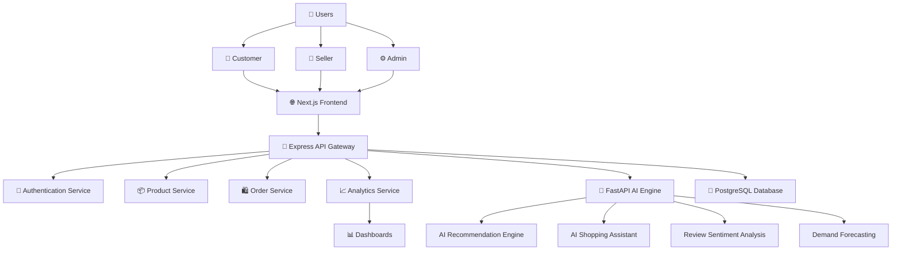
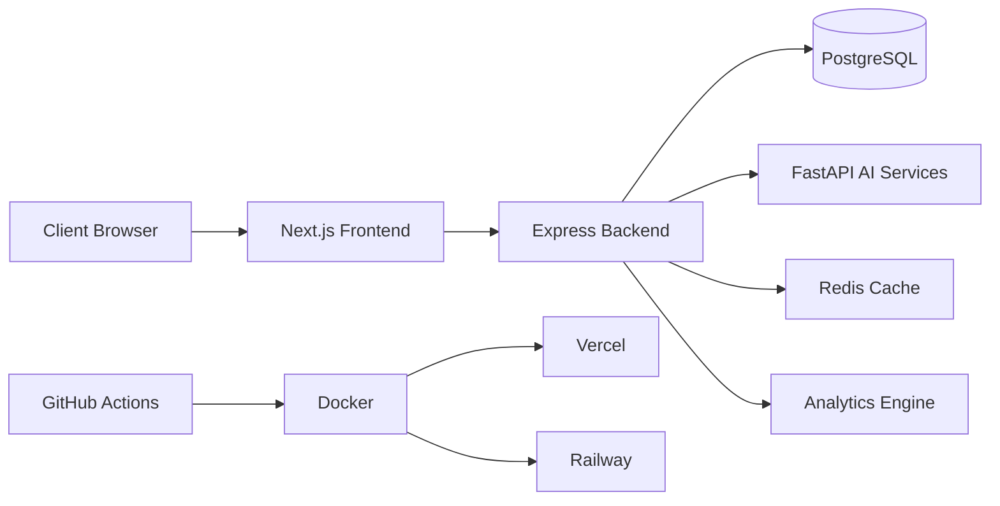
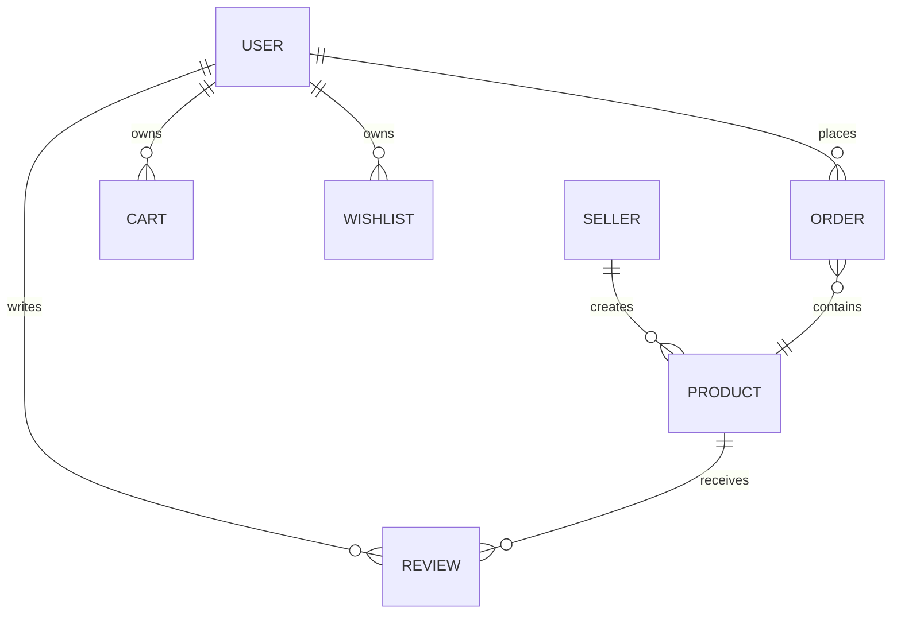
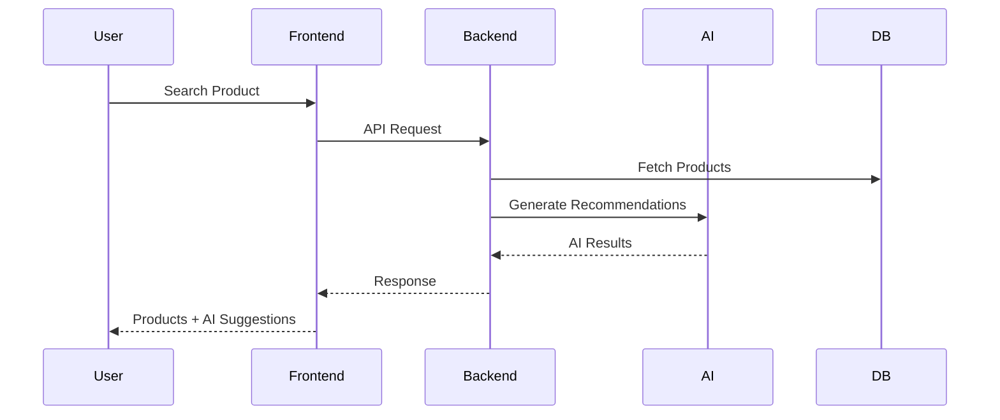
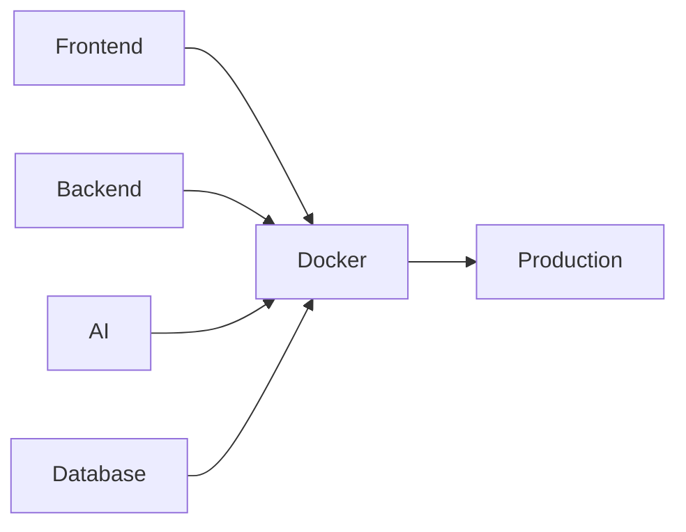
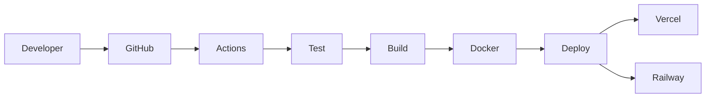

# 🌍 EcoSphere AI Commerce

### AI-Powered Sustainable E-Commerce Platform

<div align="center">


### 🚀 Next-Generation Intelligent Commerce Platform

**EcoSphere AI Commerce** is an enterprise-grade AI-powered e-commerce ecosystem that combines sustainability intelligence, explainable AI recommendations, conversational shopping, advanced analytics, demand forecasting, and modern SaaS-grade user experiences.

Designed as a **Final Year AI & Data Science Capstone Project** with industry-level architecture demonstrating:

✅ Full Stack Engineering
✅ Artificial Intelligence
✅ Machine Learning Integration
✅ Data Science Workflows
✅ Cloud Computing
✅ DevOps & CI/CD
✅ Database Design
✅ API Engineering
✅ UI/UX Design
✅ System Architecture

---

## 🎯 Project Vision

Traditional e-commerce platforms help users buy products.

**EcoSphere AI Commerce helps users make intelligent and sustainable purchasing decisions.**

The platform leverages AI to:

* Recommend products
* Explain recommendations
* Predict future demand
* Analyze customer sentiment
* Suggest eco-friendly alternatives
* Track carbon savings
* Improve sustainability awareness

---

# 🏗 System Architecture



---

# 🏢 Enterprise Architecture Diagram



---

# 🌟 Key Features

## 🤖 AI Shopping Assistant

ChatGPT-style shopping assistant.

Example Questions:

* Which laptop is best for AI development?
* Suggest eco-friendly products.
* Compare iPhone vs Samsung.
* Recommend products under ₹5000.

### AI Capabilities

* Context-aware responses
* Product comparison
* Sustainability recommendations
* Personalized suggestions
* Explainable reasoning

---

## 🧠 Recommendation Engine

### Content-Based Filtering

Matches:

* Categories
* Product descriptions
* Tags
* User preferences

### Collaborative Filtering

Uses:

* Similar users
* Purchase behavior
* Wishlist activity
* Browsing history

### Explainable AI

Every recommendation contains:

> Why am I seeing this recommendation?

Example:

"You purchased eco-friendly home products and recently viewed solar-powered devices."

---

## 🌱 Sustainability Intelligence

Every product contains:

| Metric       | Description                   |
| ------------ | ----------------------------- |
| Eco Score    | Sustainability rating         |
| Carbon Score | Estimated carbon footprint    |
| Green Badge  | Eco-certified indicator       |
| Alternatives | Environmentally safer options |

---

## 📈 Demand Forecasting

AI predicts:

* Future demand
* Inventory shortages
* Seasonal trends
* Revenue opportunities

Used by:

* Sellers
* Inventory Managers
* Platform Admins

---

## 😊 Sentiment Analysis

Analyzes product reviews.

Provides:

* Positive %
* Negative %
* Neutral %
* Customer Satisfaction Score

---

# 👨‍💻 User Roles

## Customer

### Features

* Registration/Login
* Browse Products
* Search Products
* Wishlist
* Cart Management
* Orders
* AI Shopping Assistant
* Sustainability Tracking

---

## Seller

### Features

* Product Management
* Inventory Control
* Revenue Analytics
* Demand Forecasting
* Order Management

---

## Admin

### Features

* User Management
* Fraud Detection
* Sustainability Monitoring
* Platform Analytics
* Seller Verification

---

# 🛠 Technology Stack

## Frontend

```text
Next.js 15
React 19
TypeScript
Tailwind CSS
ShadCN UI
Framer Motion
Recharts
```

---

## Backend

```text
Node.js
Express.js
REST APIs
JWT Authentication
OAuth Google Login
```

---

## AI Services

```text
FastAPI
Scikit-Learn
Pandas
NumPy
Transformers
Sentence Embeddings
```

---

## Database

```text
PostgreSQL
Prisma ORM
```

---

## DevOps

```text
Docker
GitHub Actions
Vercel
Railway
Supabase
```

---

# 📂 Project Structure

```text
ecosphere-ai-commerce/

├── frontend/
│
├── backend/
│
├── ai-services/
│
├── database/
│
├── docker/
│
├── docs/
│
├── .github/
│   └── workflows/
│
├── prisma/
│
├── scripts/
│
└── README.md
```

---

# 📊 Database Design



---

# 🗄 Database Models

## User

```sql
id
name
email
password
role
createdAt
```

---

## Product

```sql
id
title
description
price
category
stock
ecoScore
carbonScore
sellerId
```

---

## Order

```sql
id
userId
status
totalAmount
createdAt
```

---

## Review

```sql
id
rating
comment
sentimentScore
productId
userId
```

---

# 🔄 Application Flow



---

# 🚀 API Architecture

## Authentication

```http
POST /api/auth/signup
POST /api/auth/login
POST /api/auth/logout
```

## Products

```http
GET /api/products

GET /api/products/:id

POST /api/products

PUT /api/products/:id

DELETE /api/products/:id
```

## Orders

```http
GET /api/orders

POST /api/orders
```

## AI Services

```http
POST /api/ai/chatbot

POST /api/ai/recommendations

POST /api/ai/sentiment

POST /api/ai/forecast
```

---

# 📊 Analytics Dashboard

### Customer Analytics

* Spending Trends
* Orders
* Carbon Savings
* Personalized Recommendations

### Seller Analytics

* Revenue
* Inventory Forecast
* Conversion Rates

### Admin Analytics

* Total Users
* Revenue
* Fraud Alerts
* Sustainability Metrics

---

# 🔐 Security Features

### Authentication

* JWT
* OAuth Google Login
* Role-Based Access Control

### Security

* Helmet
* Rate Limiting
* Input Validation
* SQL Injection Prevention
* XSS Protection

---

# 🐳 Docker Architecture



---

# ⚙️ CI/CD Pipeline



---

# 📈 Scalability Strategy

Supports:

* Millions of Users
* Horizontal Scaling
* Containerized Services
* Distributed AI Services
* Cloud Native Deployment

Future Enhancements:

* Kubernetes
* Kafka
* Redis Clustering
* Microservices Architecture

---

# 🎓 Learning Outcomes

This project demonstrates:

### Software Engineering

* Frontend Development
* Backend Development
* API Design
* Database Modeling

### Artificial Intelligence

* Recommendation Systems
* NLP Chatbots
* Sentiment Analysis
* Forecasting Models

### Data Science

* Analytics
* Data Pipelines
* Feature Engineering

### DevOps

* Docker
* CI/CD
* Cloud Deployment

### System Design

* Scalability
* Reliability
* Security
* Observability

---

# 💼 Resume Highlights

✔ Built enterprise-grade AI-powered e-commerce platform

✔ Implemented explainable recommendation engine

✔ Developed AI shopping assistant using NLP

✔ Designed scalable PostgreSQL architecture

✔ Created cloud-native deployment pipelines

✔ Built interactive analytics dashboards

✔ Integrated sustainability intelligence system

✔ Applied modern software engineering principles

---

# 🚀 Deployment

Frontend

```bash
npm run build
vercel deploy
```

Backend

```bash
docker-compose up -d
```

AI Services

```bash
uvicorn app.main:app --reload
```

---

# 🤝 Contributing

Contributions are welcome.

1. Fork Repository
2. Create Feature Branch
3. Commit Changes
4. Open Pull Request

---

# 📜 License

MIT License

---

## ⭐ If you found this project useful, please give it a star and support sustainable AI-driven commerce.

Made with ❤️ using AI, Data Science, Cloud Computing, and Modern Software Engineering.
